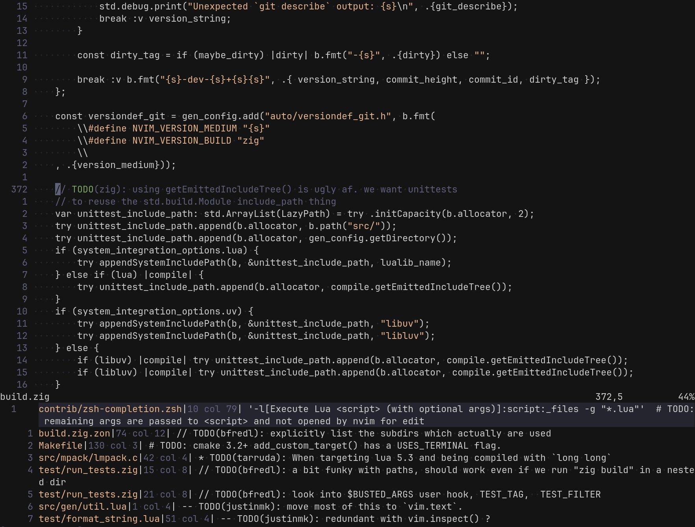

# vague-quiet.nvim

A quiet, near-monochrome Neovim colorscheme based on
[vague.nvim](https://github.com/vague-theme/vague.nvim).

It uses only three distinct colors for syntax highlighting: plain text,
comments, and string literals. This reduces visual noise and helps large
non-code sections stand out, leaving language syntax "quiet".
